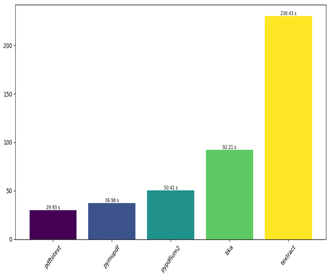
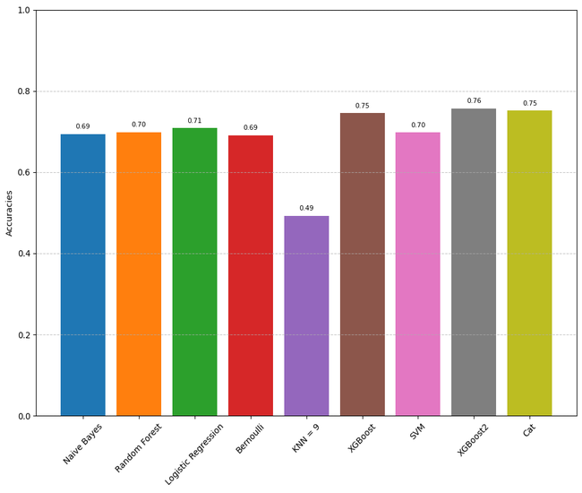
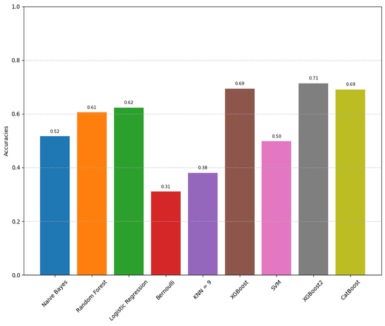
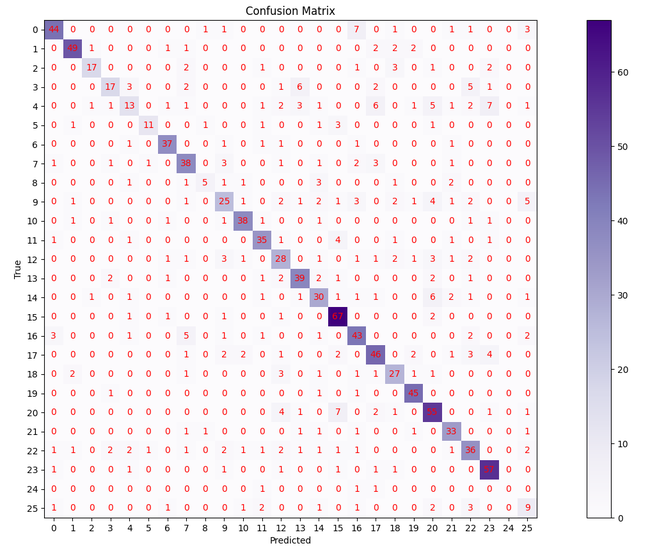
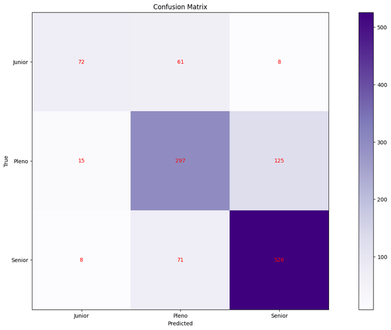

Here’s a refined and more polished presentation of your document:

---

# Curriculum Classifier

## REST API for Classifying Curricula Using Machine Learning Algorithms


This project demonstrates a REST API that processes PDF resumes to return the field of occupation and seniority level, along with the accuracy of the classification. The machine learning model was trained with 26 occupation categories and over 3,000 resumes.

---

## Features

- **PDF Processing**: Extracts text from PDF resumes with high efficiency.
- **Machine Learning Classification**: Classifies resumes into 26 occupation fields and multiple levels of seniority.
- **REST API**: Provides a simple API for integration with other systems.
- **Model Persistence**: Uses `joblib` to save and load trained models for deployment.
- **Comprehensive Documentation**: Includes API documentation and performance benchmarks.

---

## Getting Started

### Prerequisites

- Python 3.8 or higher
- Pip (Python package manager)

### Installation

1. **Clone the repository**:
   ```bash
   git clone https://github.com/viniciusmecosta/cvClassifier.git
   cd cvClassifier
   ```

2. **Install dependencies**:
   ```bash
   pip install -r requirements.txt
   ```

3. **Run the API**:
   ```bash
   uvicorn server:app --reload
   ```

4. **Access the API**:
   - The API will be available at `http://127.0.0.1:8000`.
   - Interactive API documentation (Swagger UI) is available at `http://127.0.0.1:8000/docs`.

---

## Dataset

The model was trained on a custom dataset tailored for this use case. You can find the dataset on Kaggle:

[Resume Occupation and Seniority Dataset](https://www.kaggle.com/datasets/danicardeal/resume-occupation-and-seniority)

---

## Benchmarks and Algorithms Comparison

### PDF Extraction Libraries Benchmark



- **Benchmark**: Time taken to process all PDFs in the dataset.
- **Libraries Evaluated**: Tika, PyMuPDF, Textract, Pypdfium2.
- **Library Chosen**: `pdftotext` for superior performance in processing time.

### Classification of Seniority and Area of Expertise

#### Seniority Classification
The seniority classifier was trained using text and seniority fields from the dataset.

#### Area of Expertise Classification
The area of expertise classifier was trained using both the class number and text fields.

---

## Preprocessing

The following preprocessing steps were implemented:

- **Spacy**:
  - Stopwords Removal
  - Lemmatization
  - Tokenization
  - Large model used: `en_core_web_lg`

- **Re**:
  - Removal of hyperlinks

- **CSV**:
  - Mapping of area of expertise classifications to numerical values for training.

---

## Model Evaluation and Selection

### Models Evaluated
- Logistic Regression
- Support Vector Machine
- Random Forest
- k-Nearest Neighbors
- Bernoulli Naive Bayes
- Naive Bayes
- CatBoost
- XGBoost

### Model Chosen
**XGBoost** was selected for its superior performance in both seniority and area of expertise classification.

---

## Vectorizer and Model Persistence

- **Vectorizer**: `CountVectorizer` from `sklearn` was used to vectorize the text data.
- **Model Persistence**: The trained model was exported and loaded using `joblib` for deployment and inference.

---

## Results

### Accuracies

#### Seniority Accuracy


#### Area of Expertise Accuracy


### Confusion Matrices

#### Confusion Matrix for Area of Expertise


#### Confusion Matrix for Seniority


---

## Conclusion

This project demonstrates a solid proof of concept for a REST API that classifies resumes into specific fields of occupation and levels of seniority using machine learning algorithms. Trained on a custom dataset of over 3,000 resumes spanning 26 occupations, the model provides accurate classifications while offering valuable insights into PDF extraction libraries and machine learning models.

### Key Takeaways

1. **Effective PDF Processing**: After evaluating multiple libraries for PDF extraction, `pdftotext` was chosen for its superior performance.
   
2. **Comprehensive Preprocessing**: Text processing using `Spacy` (stopwords removal, lemmatization, tokenization) and hyperlink removal with `Re` ensured clean, relevant data for training.

3. **Model Evaluation and Selection**: Among the evaluated models, XGBoost delivered the best results, offering high accuracy in both seniority and area of expertise classifications.

4. **Data Vectorization and Persistence**: The use of `CountVectorizer` for vectorization and `joblib` for model persistence streamlined deployment and inference, ensuring scalability and efficiency.

5. **Accuracy and Performance**: The accuracies and confusion matrices demonstrate the model's effectiveness and reliability in both seniority and area of expertise classifications.

This project highlights the potential of automated resume classification and provides a comprehensive learning experience in handling real-world data, evaluating multiple libraries, and implementing a complete machine learning pipeline.

---

**Free Software, Hell Yeah!**